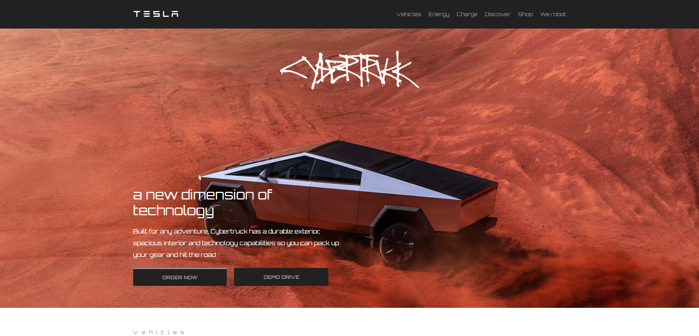
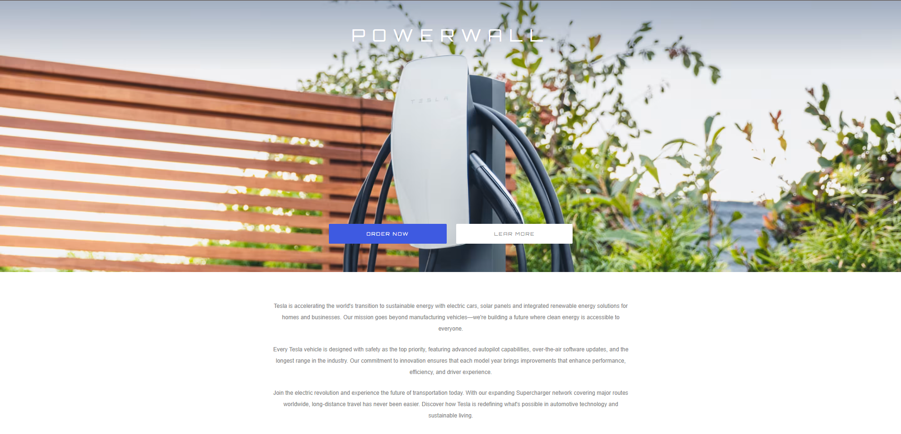
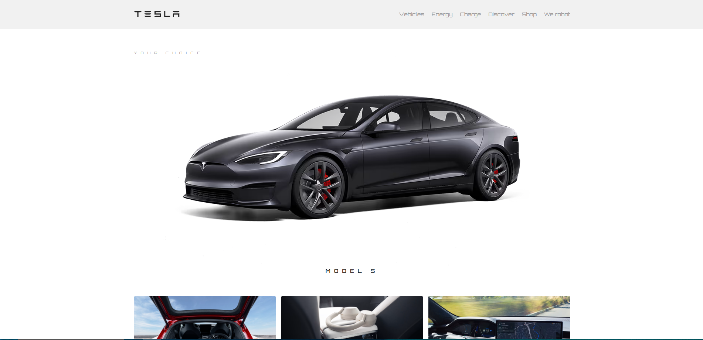
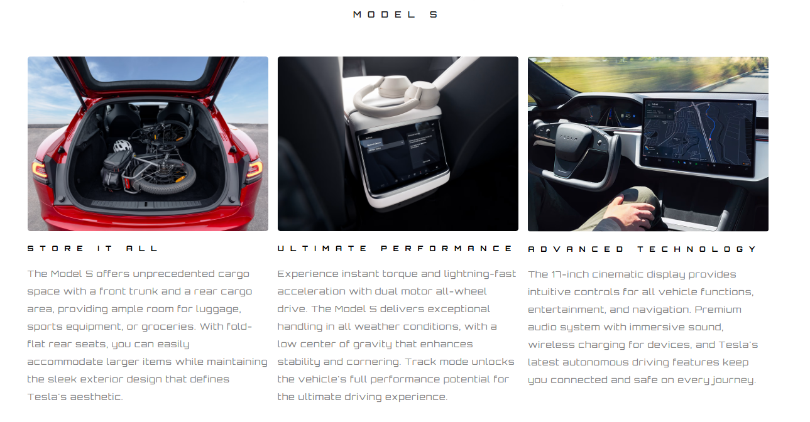
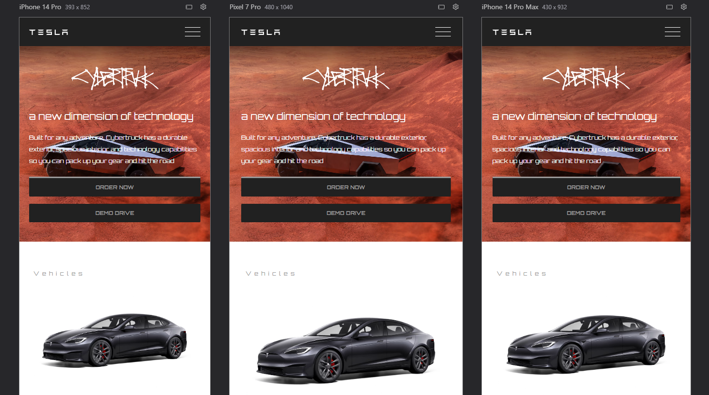

# ⚡ Tesla Website Landing Page

Landing page moderna e responsiva inspirada no site oficial da Tesla, apresentando a linha de veículos elétricos e tecnologias sustentáveis.

## 🖼️ Preview

## 📋 Sobre o Projeto

Site desenvolvido para apresentar os veículos Tesla, com foco em design minimalista, navegação intuitiva e experiência responsiva em todos os dispositivos. O projeto apresenta duas páginas principais: a página inicial com a linha completa de veículos e uma página de detalhes do Model S.

## ✨ Funcionalidades

* 🎨 Design moderno e minimalista
* 📱 Totalmente responsivo (mobile, tablet e desktop)
* ⚡ Hero section destacando a Cybertruck
* 🚘 Grid de veículos Tesla
* 📝 Formulário de contato integrado
* 🎯 Navegação fluida entre páginas
* 🔄 Animações e transições suaves

## 🛠️ Tecnologias Utilizadas

* **HTML5** - Estrutura semântica
* **CSS3** - Estilização e animações
* **Google Fonts** - Tipografia Orbitron
* **CSS Grid & Flexbox** - Layout responsivo
* **Media Queries** - Responsividade

## 📁 Estrutura do Projeto

🎨 Paleta de Cores
CSS

:root {
  --dark-primary: #212121; /* Fundo escuro */
  --gray-text: #9A9999;    /* Texto secundário */
  --blue-accent: #3E5AE1;  /* Botões e destaques */
  --light-gray: #828282;   /* Texto terciário */
  --white: #FFFFFF;      /* Fundo claro */
}
🚀 Como Usar
Clone o repositório:

Bash

git clone [https://github.com/joaolucasbatista/tesla-website.git](https://github.com/joaolucasbatista/tesla-website.git)

Navegue até a pasta do projeto:

Bash

cd tesla-website
Abra o arquivo index.html no navegador ou use uma extensão como Live Server no VS Code.

📄 Páginas
Index (Página Principal)
Hero section com Cybertruck

Grid com 4 modelos de veículos

Banners promocionais (Powerwall)

Informações sobre a Tesla

Footer com links úteis

Car Details (Detalhes do Veículo)
Banner do Model S

Features do veículo (3 destaques)

Banner interno

Formulário de contato

Especificações e informações

🎯 Melhorias Futuras
Menu mobile funcional (hamburger)

Páginas individuais para cada modelo

Integração com API de formulário

Galeria de imagens interativa

Animações mais avançadas

Dark mode toggle

Suporte a múltiplos idiomas

👨‍💻 Autor
Desenvolvido com ⚡ por João Lucas Batista

📝 Licença
Este projeto é um estudo pessoal e não possui afiliação oficial com a Tesla, Inc. Todos os direitos das marcas e logos pertencem à Tesla.

⭐ Se gostou do projeto, deixe uma estrela no repositório!
